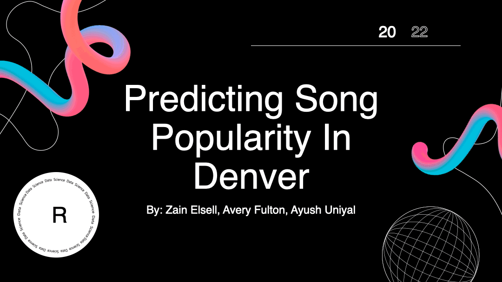

# Spotify Data Science

- The overall goal of this analysis is to determine statistically significant correlations between a particular song metrics or “Audio Features” and the probability that a certain mood of the song will have an increase in the number of plays over time. 

## The project will atttempt to answer the following:
  - What metrics can be used to measure the likelihood of a song “trending”? 
  - Typically what songs trend in a particular region? 
  - How can we predict the kind of songs that will be popular in the future
  - Can machine learning models and regression models be applied to accurately predict a songs chart ranking in a region?

## Presenation Slides:

- Please note that under the **/ppt_pres/** folder the slides can be downloaded in 3 formats, with the PDF being the highest quality.
